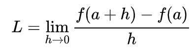
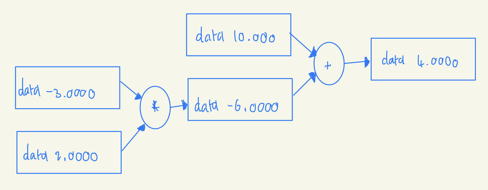

# Micrograd

Micrograd is a tiny, self-contained, and easy-to-understand deep learning library. It's a great place to start if you want to learn how deep learning works under the hood. It is an autograd library, which means that it can automatically compute gradients for you. It is also a neural network library, which means that it can compute gradients for you and update the weights of your neural network.

## Review of video and project
* In progress...

## Tips I found useful in learning this course
I've had about 14 years of formal schooling now (high school and university), and have countless wasted hours under my belt. Over time I realized how important online learning is and figured out what works with iteration.

1. Watch section of video without coding, taking notes if that helps you follow along (as long as you focus - notes are not entirely necessary, but helps me get info inside my head)
2. Go through code step by step without video, trying to explain and label each step in your own words. If you get stuck go back to see what Andrej said.
3. (Optional. Doing step 1 and 2 is the 20% that will give you 80% of the learning, this is just an extra few percent) Try and implement it on your own, without his code.

# Building Micrograd
## Overview
* Micrograd does the mathematical operations that are needed to train a neural network such as:
    1. Forward pass
        - Compute the output of a neural network given an input and a set of weights
    2. Backpropogation
        - Backpropogation is the process of computing the gradient of the loss function with respect to the weights of the neural network. This is done by computing the gradient of the loss function with respect to the output of the neural network, and then computing the gradient of the output with respect to the weights of the neural network. This is done recursively until the gradient of the loss function with respect to the input of the neural network is computed.
* Andrej claims that Micrograd is all you need to train neural networks and the rest is just added for effiency and convenience. This is why Micrograd is so important to understand.
    - A good example is the use of tensors (which we do not use in micrograd) which are simply used to do many scalar operations that micrograd does in parallel.
    - For such a fundamentally important piece of machine learning, it is suprisingly simple. There are literally only 2 python files.

## Derivative of a simple function
* The derivative of a function is the slope of the tangent line at a point or the rate of change of the function at a point.
    - Andrej makes the assumption that we had a calculus class, but still goes into great detail about what the derivative of a function is.  
      
    He uses the differentiability defenition of a function to show how a single and multi-variable input might affect the derivative of a function.

## Starting the core Value object of micrograd and its visualization
* The core object of micrograd is the Value object. It is a simple object that has a value and a gradient. The gradient is the derivative of the value with respect to the input of the function. The gradient is initialized to 0 and is updated by the backward() function.
    - Andrej walks throuhg implementing the Value object and then shows how it does computations with different operations we specify.
    - He uses the graphviz library to visualize the computation graph of the Value object. This is a great way to visualize the computation graph and see how the gradient is computed.  
      

## Backpropogation
* A lot of calculus is used to calculate partial derivatives (thank goodness I study math! Look mom, I'm using it!)
    - To do backprop, we use the chain rule to calculate the effect of each operation on the gradient of the output.
* Neurons are input neurons, hidden neurons, and output neurons. The input neurons are the input to the neural network, the hidden neurons are the neurons in the hidden layers, and the output neurons are the output of the neural network.
    - Neurons have complicated mathematical representations, but we have a simple representation of a neuron that is just a Value object with a weight and a bias.
    - We take all the inputs through an activation function (in this case a tanh function) to get the output of the neuron.
    - The result is just the dot product of the inputs and the weights of the neuron, plus the bias of the neuron.
* We implemented backpropogation manually for, then implemented it to do it automatically, at least for one neuron.
    - We implemented the backward() function for each operation to do backpropogation automatically, basically.
    - To do it automatically, we built a DAG (directed acyclic graph) of the computation graph. This is a graph that shows the order of operations and the dependencies between operations.

## Putting it together
* We implemented all the operations necessary to do forward and backpropogation with any operation (+, -, /, *, tanh).
    - Andrej is very adament on doing the basics, so we delved into derivative rules and breaking up tanh into an equation using the hyperbolic tangent function.
      - He did this to show that it doesn't matter how complicated the function we use is, as long as we get the correct forward pass and backpropogation, we can use any appropriate function.
* Andrej showed how Pytorch does it, which basically does what Micrograd does with tensors, which allow for parallel computation of many scalar operations. Tensors are arrays of scalar values.

## Building a neural net library (multi-layer perceptron)
* In progress...

# References
* [Andrej Karpathy's Micrograd Project](https://github.com/karpathy/micrograd)
* [Andrej Karpathy's Micrograd Video](https://youtu.be/VMj-3S1tku0)